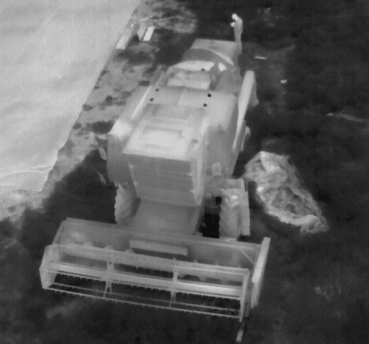
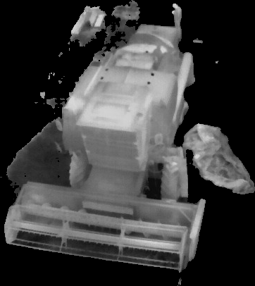
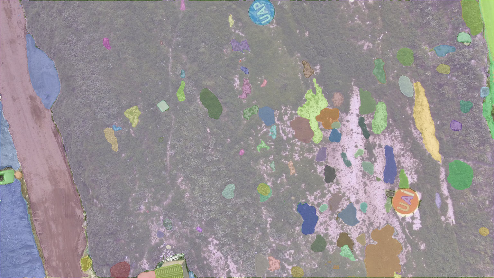
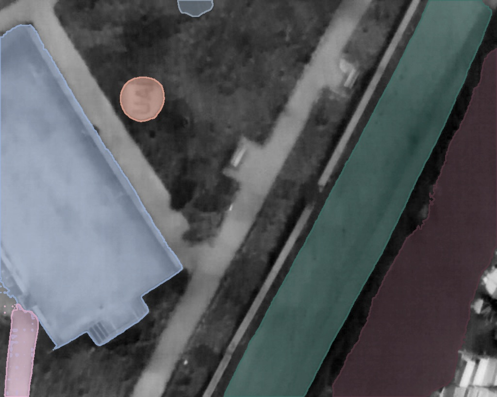
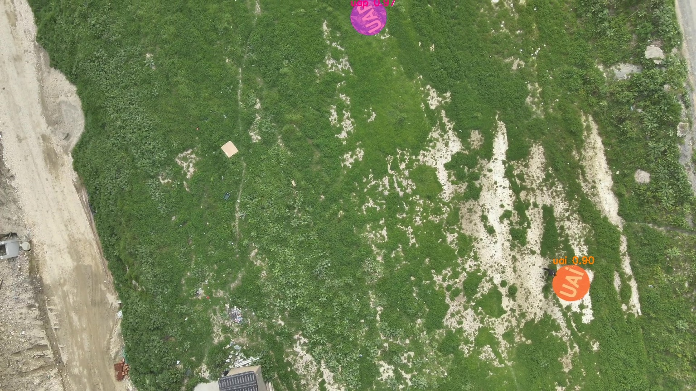

# drone-reference-matching

**Find and track a specific reference object in drone video — RGB or thermal —
from just a photo of it.**

You give it a handful of reference photos (a vehicle, a landing marker, …). For
each incoming frame it segments every object, embeds each one with a single
**DINOv3 ViT-L** vision backbone, and matches it to the references by cosine
similarity. The same identity model works **cross-modal**: a reference cut from an
RGB photo can be matched against a thermal frame. A SAM2 streaming tracker then
locks onto the winning object and follows it frame to frame.

Built for the reference-object task of a TEKNOFEST 2026 (aviation AI) project.

---

## See it work

**1. Reference cutout (HQ-SAM).** The main object is isolated in each reference
photo — background removed — so the embedding captures identity, not surroundings.
Here a thermal reference (a combine harvester), original → cutout:

<table>
<tr>
<td width="50%"></td>
<td width="50%"></td>
</tr>
<tr>
<td align="center"><em>reference photo</em></td>
<td align="center"><em>HQ-SAM cutout</em></td>
</tr>
</table>

**2. RGB frame segmentation (CropFormer).** Every entity in the frame gets its own
clean mask:



**3. Thermal frame segmentation (SAM2).** Shape-driven masks that hold up on
low-texture thermal:



**4. Match.** Each segment is embedded with DINOv3 and compared to the active
references; anything above threshold is a detection. Here the landing markers are
found — **UAP at 0.97**, **UAI at 0.90** cosine:



---

## Pipeline

```
                        ┌─────────────── once per session ───────────────┐
  reference photos ──▶  │  HQ-SAM cutout  ──▶  DINOv3 masked embedding    │ ──▶ ref_bank.npz
                        │  (box+point prompt)   (color + grayscale)       │     (color & gray vecs)
                        └─────────────────────────────────────────────────┘
                        ┌─────────────── every frame ────────────────────┐
     drone frame  ──▶   │  segment  ──▶  DINOv3 masked emb  ──▶  cosine   │ ──▶ best match ≥ threshold
                        │  RGB: CropFormer                     vs active   │        │
                        │  thermal: SAM2 automatic             references  │        ▼
                        └─────────────────────────────────────────────────┘   SAM2 streaming
                                                                                tracker (box out)
```

**Why it works**
- **One identity model, cross-modal.** A single DINOv3 ViT-L embeds both references
  and frame objects. RGB session → color embedding; thermal session → grayscale
  (references are stored both ways). DINOv3 must run in **fp32** (fp16 → NaN).
- **Masked embedding is essential.** Embeddings average only the patch tokens
  *inside the object mask*, so background doesn't pollute the identity vector. This
  is what makes cross-modal matching hold up.
- **Segmenter per modality.** RGB frames use CropFormer (clean whole-entity masks);
  thermal frames use SAM2 automatic masks (shape-driven, works with weak texture).
- **Reference cutout is shared.** HQ-SAM (box + center points) isolates the main
  object in every reference photo, RGB or thermal alike.
- **Streaming tracker.** Once matched, a causal SAM2 video predictor (encode-once,
  growing memory bank) tracks the object; the detector re-anchors it with a
  motion-compensated median of recent detections.

Reported quality on internal tests: intra-modal matches ≈ 0.9+ cosine; cross-modal
(thermal frame vs RGB reference) works with the 0.40 thermal threshold.

---

## Requirements

**A CUDA GPU is required** — all four backbones run on GPU. There is no CPU-only
path. This is a research/reference implementation, not a lightweight library.

```bash
python -m venv venv && source venv/bin/activate
pip install -r requirements.txt
```

Then install the model backends from source (see links in `requirements.txt` and
below). Run everything from the repo root so the `src` package resolves.

## Models

Weights are **not** committed (>3 GB total; see `.gitignore`). Download each into
the path `paths.py` expects:

| Model | Role | Download → put at |
| ----- | ---- | ----------------- |
| **DINOv3 ViT-L/16** | identity embedding (the one model that matters) | [facebookresearch/dinov3](https://github.com/facebookresearch/dinov3) → `models/shared/dinov3_vitl16/` |
| **HQ-SAM (vit_l)** | reference cutout | [SysCV/sam-hq](https://github.com/SysCV/sam-hq) → `models/shared/sam_hq_vit_l.pth` |
| **SAM2.1 hiera-large** | thermal frame seg + tracker | [facebookresearch/sam2](https://github.com/facebookresearch/sam2) → `models/termal_models/reference/sam2.1_hiera_large.pt` |
| **CropFormer swin-tiny 3x** | RGB frame seg | [qqlu/Entity](https://github.com/qqlu/Entity) → `models/rgb_models/reference/CropFormer_swin_tiny_3x.pth` + clone repo to `third_party/CropFormer` |

All paths live in [`src/task3_reference/paths.py`](src/task3_reference/paths.py) —
adjust there if you keep models elsewhere.

---

## Usage

The repo ships 8 example reference objects in
[`examples/reference_objects/`](examples/reference_objects/) (vehicles + landing
markers). Point the runner at them and at your own frame folder:

```bash
# RGB session (CropFormer frame segmenter)
python -m src.task3_reference.run_offline \
    --refs   examples/reference_objects \
    --frames path/to/rgb_frames \
    --modality rgb --glob '*.jpg' --out logs/g3_rgb

# Thermal session (SAM2 frame segmenter)
python -m src.task3_reference.run_offline \
    --refs   examples/reference_objects \
    --frames path/to/thermal_frames \
    --modality termal --glob '*.jpg' --out logs/g3_termal
```

It builds the reference bank once (`ref_bank.npz`), processes every frame, draws
matched boxes (`*_match.jpg`), and writes `results.json` with per-match cosine
scores. An optional `--schedule plan.json` restricts which reference is searched in
which frame range (`[{"object_id":4,"start":100,"end":300}, ...]`).

Just the reference cutout, for inspection:

```bash
python -m src.task3_reference.ref_extract examples/reference_objects/*.JPG \
    --out offline_data/ref_extract_out
```

---

## Layout

```
src/
  common/
    config.py         # ROOT + config loader (safe defaults, no secrets)
    schema.py         # competition JSON schema (UndefinedObject, ...)
  task3_reference/
    paths.py          # all model paths + thresholds (single source of truth)
    ref_extract.py    # HQ-SAM cutout of a reference photo
    ref_bank.py       # build ref_bank.npz (cutout -> DINOv3 color+gray embeddings)
    embedder.py       # DINOv3 ViT-L masked embedding (fp32)
    segmenters.py     # HQ-SAM / CropFormer / SAM2 wrappers
    matcher.py        # per-frame segment -> embed -> cosine -> UndefinedObject
    sam2_stream.py    # causal SAM2 wrapper (encode-once, growing memory)
    ref_tracker.py    # motion-compensated streaming tracker
    session.py        # orchestrator (single entry point)
    run_offline.py    # end-to-end offline test CLI
examples/reference_objects/   # 8 sample reference photos
models/ ...                    # download targets (git-ignored)
third_party/CropFormer/        # clone CropFormer here (git-ignored)
```

## Notes

- `config/competition.yaml` (online-client credentials) is **not** committed; copy
  `config/competition.example.yaml` if you need the live client.
- Some code comments are in Turkish (original project language); identifiers and
  this README are English.

## Credits

This project wraps four external models; their weights and licenses are their own:
- [DINOv3](https://github.com/facebookresearch/dinov3) (Meta)
- [HQ-SAM / sam-hq](https://github.com/SysCV/sam-hq) (SysCV)
- [SAM 2](https://github.com/facebookresearch/sam2) (Meta)
- [CropFormer / Entity](https://github.com/qqlu/Entity)

## License

MIT — see [LICENSE](LICENSE). (The wrapped models are not redistributed here.)
